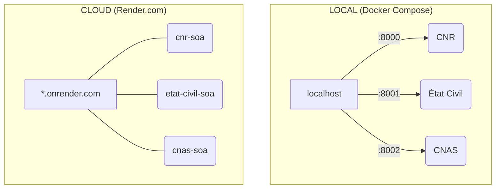

# 🇩🇿 Système National des Retraites (Simulation SOA)


> **Démonstration d'architecture orientée services (SOA) appliquée à l'administration publique algérienne, automatisant la conformité à la Loi n° 83-12 relative à la retraite.**

---

## 📖 À Propos du Projet

Ce projet simule un système de gestion des retraites **Cloud Native** qui remplace les tâches administratives manuelles par des **audits automatisés** via des micro-services interconnectés.

Le cœur du système est un moteur de règles juridiques appliquant strictement la loi algérienne en temps réel :

- **🛡️ Anti-Fraude (Art. 8)** : Détection automatique du cumul (Retraite + Salaire)
- **⚖️ Continuité des Droits (Art. 30)** : Bascule automatique vers une **Pension de Réversion** (Veuve/Orphelins) dès confirmation du décès

### 🎯 Objectifs

- ✅ Démontrer une architecture SOA moderne pour l'administration publique
- ✅ Automatiser la vérification de conformité légale (Loi 83-12)
- ✅ Simuler l'interopérabilité entre services gouvernementaux
- ✅ Fournir une API REST documentée et testable

---

## 🏗️ Architecture SOA

### 📐 Vue d'Ensemble

```
┌─────────────────────────────────────────────────────────────┐
│                    ARCHITECTURE SOA                         │
├─────────────────────────────────────────────────────────────┤
│                                                             │
│  ┌──────────────┐                                          │
│  │   Client     │  HTTP REST                               │
│  │  (Agent CNR) │────────────┐                             │
│  └──────────────┘            │                             │
│                              ▼                              │
│                    ┌──────────────────┐                     │
│                    │   CNR Service    │  Port 8000          │
│                    │  (Orchestrateur) │                     │
│                    └────────┬─────────┘                     │
│                             │                               │
│              ┌──────────────┼──────────────┐                │
│              │              │              │                │
│              ▼              ▼              ▼                │
│    ┌─────────────┐  ┌─────────────┐  ┌──────────┐          │
│    │ État Civil  │  │    CNAS     │  │PostgreSQL│          │
│    │  Service    │  │   Service   │  │    DB    │          │
│    │  Port 8001  │  │  Port 8002  │  │ Port 5432│          │
│    └─────────────┘  └─────────────┘  └──────────┘          │
│                                                             │
└─────────────────────────────────────────────────────────────┘
```

### 🎯 Principes SOA Implémentés

| Principe | Implémentation | Bénéfice |
|----------|----------------|----------|
| **Couplage Faible** | Communication via HTTP REST | Modification indépendante des services |
| **Réutilisabilité** | État Civil utilisable par d'autres ministères | Évite la duplication de code |
| **Interopérabilité** | Protocoles standards (REST/JSON) | Consommation par n'importe quel client |
| **Autonomie** | Déploiement en conteneurs séparés | Aucun point de défaillance unique |
| **Découvrabilité** | Documentation Swagger/OpenAPI | Exploration facile des contrats |

### 🔄 Flux SOA - Scénario Audit

**Exemple concret : Vérification d'un bénéficiaire**

```
1. Agent CNR → GET /beneficiaires/1/audit

2. Service CNR (main.py):
   ├─→ Récupère le bénéficiaire depuis PostgreSQL
   └─→ ORCHESTRATION (appels parallèles):
       ├─→ GET http://etat-civil-api:8001/verify/{nss}
       └─→ GET http://cnas-api:8002/employment/{nss}

3. Service État Civil → {"en_vie": false, "date_deces": "2024-..."}
4. Service CNAS → {"employe_actif": false}

5. Service CNR:
   ├─→ Moteur de règles applique Loi 83-12
   ├─→ Décision: DÉCÈS → Créer Pension de Réversion
   ├─→ Enregistre dans PostgreSQL
   └─→ Retourne le statut juridique
```

### 🔧 Services

#### 1️⃣ Service CNR (Orchestrateur - Port 8000)
**Fichier :** `main.py`

**Endpoints :**
- `POST /beneficiaires/` - Création de dossier
- `GET /beneficiaires/` - Liste des dossiers
- `GET /beneficiaires/{id}/audit` - Audit juridique (orchestration SOA)
- `GET /health` - Vérification santé

**Base de Données :** PostgreSQL (Tables: `beneficiaires`, `reversions`)

#### 2️⃣ Service État Civil (Port 8001)
**Fichier :** `service_etat_civil.py`  
**Rôle :** Vérification de l'existence physique (Loi 83-12, Article 6)

**Endpoint :** `GET /verify/{nss}`

**Réponse :**
```json
{
  "nss": "25-16-12345-00",
  "en_vie": false,
  "date_deces": "2024-02-11T14:30:00",
  "lieu_naissance": "Alger (Mock)"
}
```

**Logique Mock :** NSS terminant par "00" → Décédé

#### 3️⃣ Service CNAS (Port 8002)
**Fichier :** `service_cnas.py`  
**Rôle :** Vérification d'activité salariée (Loi 83-12, Article 8)

**Endpoint :** `GET /employment/{nss}`

**Réponse :**
```json
{
  "nss": "25-16-12345-99",
  "employe_actif": true,
  "employeur": "SONELGAZ (Mock)",
  "secteur_activite": "Énergie",
  "salaire_mensuel": 45000.0
}
```

**Logique Mock :** NSS terminant par "99" → Employé actif (FRAUDE)

### 🔐 Résilience (Mode Dégradé)

Si un service externe tombe, le système CNR continue de fonctionner :

```python
try:
    response = await client.get(f"{ETAT_CIVIL_URL}/verify/{nss}")
    return response.json()
except httpx.RequestError:
    return {"en_vie": True, "error": "Service unavailable"}
```

---

## 🔧 Stack Technologique

| Composant | Technologie | Rôle |
|-----------|-------------|------|
| **Backend** | Python 3.12 | Langage principal |
| **Framework** | FastAPI 0.109+ | REST API haute performance |
| **Communication** | httpx 0.26+ | Client HTTP asynchrone (SOA) |
| **Base de Données** | PostgreSQL 16 | Persistance relationnelle |
| **ORM** | SQLAlchemy 2.0+ | Mapping objet-relationnel |
| **Conteneurisation** | Docker + Compose | Isolation et orchestration |
| **Serveur** | Uvicorn | Serveur ASGI asynchrone |
| **Validation** | Pydantic 2.0+ | Validation des données |

---

## 🚀 Démarrage Rapide

### 📋 Prérequis

- Docker & Docker Compose
- (Optionnel) Python 3.12+ pour développement local

### 🐳 Installation Local (Docker Compose)

```bash
# 1. Cloner le dépôt
git clone https://github.com/Oussamirsekkal/cnr-soa.git
cd cnr-soa

# 2. Construire et démarrer tous les services
docker-compose up --build

# 3. Vérifier que tout fonctionne
curl http://localhost:8000/health
curl http://localhost:8001/health
curl http://localhost:8002/health
```

**Accès aux services :**
- 📘 CNR API : http://localhost:8000/docs
- 📗 État Civil API : http://localhost:8001/docs
- 📙 CNAS API : http://localhost:8002/docs

### ☁️ Déploiement Cloud (Render)

Chaque service est déployé avec son propre sous-domaine HTTPS :

| Service | URL |
|---------|-----|
| **CNR** | https://cnr-soa.onrender.com |
| **État Civil** | https://etat-civil-soa.onrender.com |
| **CNAS** | https://cnas-soa.onrender.com |

---

## 📡 Guide des Commandes API

> **Note :** Toutes les commandes sont fournies pour **Local** (Docker) et **Cloud** (Render)

### 🌐 URLs de Base

**Local :**
```
CNR:         http://localhost:8000
État Civil:  http://localhost:8001
CNAS:        http://localhost:8002
```

**Render :**
```
CNR:         https://cnr-soa.onrender.com
État Civil:  https://etat-civil-soa.onrender.com
CNAS:        https://cnas-soa.onrender.com
```

### 🔹 Service CNR

<details>
<summary><b>📝 Créer un bénéficiaire</b></summary>

**Local :**
```bash
curl -X POST "http://localhost:8000/beneficiaires/" \
  -H "Content-Type: application/json" \
  -d '{"nom_complet": "Ahmed Benali", "type_simulation": "normal", "montant_pension": 30000.0}'
```

**Render :**
```bash
curl -X POST "https://cnr-soa.onrender.com/beneficiaires/" \
  -H "Content-Type: application/json" \
  -d '{"nom_complet": "Ahmed Benali", "type_simulation": "normal", "montant_pension": 30000.0}'
```
</details>

<details>
<summary><b>📋 Lister tous les bénéficiaires</b></summary>

**Local :**
```bash
curl -sS http://localhost:8000/beneficiaires/ | jq
```

**Render :**
```bash
curl -sS https://cnr-soa.onrender.com/beneficiaires/ | jq
```
</details>

<details>
<summary><b>🔍 Effectuer un audit</b></summary>

**Local :**
```bash
curl -X GET http://localhost:8000/beneficiaires/1/audit | jq
```

**Render :**
```bash
curl -X GET https://cnr-soa.onrender.com/beneficiaires/1/audit | jq
```
</details>

<details>
<summary><b>💚 Vérifier la santé du service</b></summary>

**Local :**
```bash
curl http://localhost:8000/health
```

**Render :**
```bash
curl https://cnr-soa.onrender.com/health
```
</details>

### 🔹 Service État Civil

<details>
<summary><b>🔍 Vérifier le statut d'un citoyen</b></summary>

**Local :**
```bash
curl http://localhost:8001/verify/25-16-12345-00 | jq
```

**Render :**
```bash
curl https://etat-civil-soa.onrender.com/verify/25-16-12345-00 | jq
```
</details>

<details>
<summary><b>💚 Vérifier la santé du service</b></summary>

**Local :**
```bash
curl http://localhost:8001/health
```

**Render :**
```bash
curl https://etat-civil-soa.onrender.com/health
```
</details>

### 🔹 Service CNAS

<details>
<summary><b>🔍 Vérifier l'emploi d'un assuré</b></summary>

**Local :**
```bash
curl http://localhost:8002/employment/25-16-12345-99 | jq
```

**Render :**
```bash
curl https://cnas-soa.onrender.com/employment/25-16-12345-99 | jq
```
</details>

<details>
<summary><b>💚 Vérifier la santé du service</b></summary>

**Local :**
```bash
curl http://localhost:8002/health
```

**Render :**
```bash
curl https://cnas-soa.onrender.com/health
```
</details>

---

## 🧪 Scénarios de Test

### ✅ Cas Normal (Retraité Vivant et Inactif)
```bash
# Local
curl -X POST "http://localhost:8000/beneficiaires/" \
  -H "Content-Type: application/json" \
  -d '{"nom_complet": "Retraité Normal", "type_simulation": "normal"}'

# Render
curl -X POST "https://cnr-soa.onrender.com/beneficiaires/" \
  -H "Content-Type: application/json" \
  -d '{"nom_complet": "Retraité Normal", "type_simulation": "normal"}'
```

### 💀 Cas Décès (Pension de Réversion)
```bash
# Local
curl -X POST "http://localhost:8000/beneficiaires/" \
  -H "Content-Type: application/json" \
  -d '{"nom_complet": "Retraité Décédé", "type_simulation": "deces"}'

# Render
curl -X POST "https://cnr-soa.onrender.com/beneficiaires/" \
  -H "Content-Type: application/json" \
  -d '{"nom_complet": "Retraité Décédé", "type_simulation": "deces"}'
```

### ⚠️ Cas Fraude (Cumul Retraite + Salaire)
```bash
# Local
curl -X POST "http://localhost:8000/beneficiaires/" \
  -H "Content-Type: application/json" \
  -d '{"nom_complet": "Retraité Fraudeur", "type_simulation": "fraude"}'

# Render
curl -X POST "https://cnr-soa.onrender.com/beneficiaires/" \
  -H "Content-Type: application/json" \
  -d '{"nom_complet": "Retraité Fraudeur", "type_simulation": "fraude"}'
```

---

## 📊 Comparaison Environnements



| Environnement | Protocole | Avantage |
|---------------|-----------|----------|
| **Local** | HTTP | Développement rapide, débogage facile |
| **Render** | HTTPS | Production sécurisée, accessible publiquement |

---

## 📦 Structure du Projet

```
/
├── main.py                   # Service CNR (Orchestrateur - Port 8000)
├── service_etat_civil.py     # Service État Civil (Port 8001)
├── service_cnas.py           # Service CNAS (Port 8002)
├── docker-compose.yml        # Orchestration des conteneurs
├── Dockerfile                # Image commune aux services
├── requirements.txt          # Dépendances Python
└── README.md                 # Documentation
```

---

## 🎭 Avantages de l'Architecture SOA

| Avantage | Bénéfice Concret |
|----------|------------------|
| **Indépendance** | Redéploiement d'un service sans impact sur les autres |
| **Scalabilité** | Possibilité de lancer 10 instances CNAS si nécessaire |
| **Testabilité** | Documentation Swagger pour chaque service |
| **Interopérabilité** | Accessible depuis n'importe quel langage (Python, Java, .NET) |
| **Gouvernance** | Ministère de l'Intérieur gère État Civil, MTESS gère CNAS |
| **Résilience** | Fonctionnement en mode dégradé si un service tombe |

---

## 🔐 Sécurité en Production

**Actuellement non implémenté :** 
- Authentification par tokens (JWT/OAuth2)
- Chiffrement des communications inter-services
- Rate limiting
- Audit logs

**Recommandations pour la production :**
```python
# Ajouter dans les headers des requêtes
headers = {
    "Authorization": "Bearer <token>",
    "X-API-Key": "<api-key>"
}
```

---

## 📝 Notes de Développement

### Variables d'Environnement (SOA)

```env
# Service CNR
DATABASE_URL=postgresql://postgres:postgres@db:5432/retraite_db
ETAT_CIVIL_URL=http://etat-civil-api:8001
CNAS_URL=http://cnas-api:8002
```

### Réseau Docker

```yaml
networks:
  soa-network:
    driver: bridge
```

### Test de Résilience

```bash
# Arrêter le service État Civil
docker stop etat-civil-service

# Lancer un audit (mode dégradé)
curl http://localhost:8000/beneficiaires/1/audit
# ✅ Le système continue de fonctionner
```

---

## 🚀 Évolution vers Microservices

Pour évoluer vers une architecture microservices complète :

1. **Message Broker** : RabbitMQ/Kafka pour communication asynchrone
2. **Service Mesh** : Istio pour gestion du trafic
3. **Orchestration** : Kubernetes pour déploiement à grande échelle
4. **Observabilité** : Prometheus + Grafana pour monitoring
5. **API Gateway** : Kong/Nginx pour point d'entrée unique

---

## 📄 Licence

MIT License - Libre d'utilisation et de modification

---

## 🤝 Contribution

Les contributions sont bienvenues ! N'hésitez pas à ouvrir une issue ou une pull request.

---

## 📧 Contact

Pour toute question sur ce projet de simulation SOA, veuillez ouvrir une issue sur GitHub.
